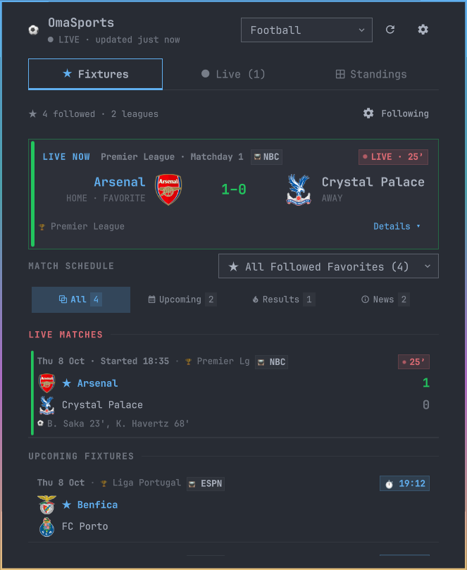

<div align="center">
  
  <h1>OmaSports</h1>
  <p><strong>Live scores, fixtures, and standings for Omarchy.</strong></p>
  <p>
    <a href="https://github.com/basecamp/omarchy">Omarchy</a> ·
    <a href="#install">Install</a> ·
    <a href="#configuration">Configure</a> ·
    <a href="#development">Development</a>
  </p>
  <p>
    
    
    <a href="LICENSE"></a>
  </p>
</div>



<p align="center"><sub>Native UI preview captured on an isolated headless display using deterministic demo data.</sub></p>

## Overview

OmaSports is a native Omarchy bar plugin for keeping up with the games you follow. Open the panel for a compact score center, or leave the live ticker enabled for a quick update beside the bar icon.

It supports football, basketball, Formula 1, American football, baseball, and ice hockey without accounts or API keys.

## Features

- **Live scores and fixtures** — Browse live games, recent results, upcoming matches, and league news.
- **Standings** — View football tables, NBA/NHL conferences, NFL conferences and MLB leagues (ordered by playoff seed), and F1 driver or constructor championships.
- **Follow teams and drivers** — Combine multiple favorites into one schedule and spotlight the next important game.
- **Anti-spoiler mode** — Hide live and finished scores until you choose to reveal them.
- **Bar ticker** — Show a followed team’s live score beside the active sport icon.
- **Desktop notifications** — Receive kickoff, goal, half-time, and full-time alerts through `notify-send`.
- **Match detail cards** — See broadcast information, venues, leaders, form, events, possession, and period scores when the provider supplies them.
- **Keyboard and IPC control** — Navigate without a mouse or script the panel with `omarchy-shell`.
- **Resilient caching** — Team crests use a local cache with remote and monogram fallbacks.

### New in 1.5.0

A native redesign brings a compact sport picker, fixed navigation, clearer scores, flatter match lists, and grouped preferences. The spotlight starts compact, with optional match details. Recent results show a three-game preview with expansion, and fixture controls support keyboard navigation with contextual hints. ESPN refreshes prioritize today's games and cache surrounding dates and standings. Notification cancellation, postponed-game labels, inning updates, and kickoff countdowns also received fixes.

See [the changelog](CHANGELOG.md) for release notes and [RUNNING.md](RUNNING.md) for update instructions.

## Supported sports

| Sport | Coverage | Provider |
| --- | --- | --- |
| ⚽ Football / soccer | 100+ leagues and cups, including Premier League, La Liga, Primeira Liga, Serie A, Bundesliga, Champions League, MLS, and Brasileirão | [FotMob](https://www.fotmob.com/) |
| 🏀 Basketball | NBA teams, fixtures, and Eastern/Western Conference standings | [ESPN](https://www.espn.com/) |
| 🏎 Formula 1 | Grand Prix calendar, sessions, driver standings, and constructor standings | [Jolpica](https://api.jolpi.ca/ergast/f1/) |
| 🏈 American football | NFL fixtures and AFC/NFC standings | [ESPN](https://www.espn.com/) |
| ⚾ Baseball | MLB fixtures and American/National League standings | [ESPN](https://www.espn.com/) |
| 🏒 Ice hockey | NHL fixtures and Eastern/Western Conference standings | [ESPN](https://www.espn.com/) |

Provider data is public and may change, be rate-limited, or be temporarily unavailable. OmaSports does not require credentials and does not send data to a separate OmaSports service.

## Install

### From GitHub

```bash
omarchy plugin add https://github.com/27mfp/miguel.omasports --enable
```

The plugin appears in the center section of the Omarchy bar. Open it from the bar icon, then select a sport and the teams or leagues you want to follow.

### From a local checkout

Follow [Running OmaSports from source](RUNNING.md#install-the-working-tree-into-the-live-bar) for installation and updates. It covers copied installations, linked development checkouts, validation, and when to restart the shell.

To remove it:

```bash
omarchy plugin remove miguel.omasports
```

## Configuration

The panel’s settings screen controls notifications, background polling, anti-spoiler mode, refresh cadence, followed teams, the bar ticker, the spotlight card, and the league news wire.

The plugin also exposes these manifest settings:

| Setting | Default | Description |
| --- | --- | --- |
| `showBarTicker` | `true` | Show a followed team’s live score in the bar. |
| `backgroundUpdates` | `true` | Keep score data fresh while the panel is closed. |
| `panelPosition` | `auto` | Choose automatic, icon-anchored, or centered panel placement. |

Preferences are stored locally at:

```text
~/.config/omarchy/sports-favorites.json
```

Team crests are cached locally at:

```text
~/.cache/omarchy-omasports/logos/
```

## Keyboard and IPC

Inside the panel:

| Key | Action |
| --- | --- |
| `r` | Refresh scores |
| `s` | Toggle anti-spoiler mode |
| `←` / `→` | Move between tabs and controls |
| `Enter` | Activate the focused control or match |

Common shell commands:

```bash
omarchy-shell miguel.omasports toggle
omarchy-shell miguel.omasports route live
omarchy-shell miguel.omasports sport f1
omarchy-shell miguel.omasports refresh
omarchy-shell miguel.omasports toggleSpoiler
omarchy-shell miguel.omasports getActiveSport
```

The complete IPC contract, including safe headless-test controls, is documented in [DEVELOPMENT.md](DEVELOPMENT.md).

## Requirements

- Omarchy with its Quickshell-based desktop shell
- Python 3 (`/usr/bin/python3`) for bounded provider requests and secure local state/cache handling
- `xdg-open` for opening provider match pages
- `notify-send` for desktop notifications (optional; scores still work without it)

No account, API key, background daemon, or separate service is required.

## Development

Validate the plugin and run the fast local quality gate:

```bash
omarchy plugin validate .
node tests/run-all.mjs --quick
```

The repository also includes:

```bash
node tests/ui-session.mjs -- node tests/interaction.mjs # isolated IPC and navigation tests
node tests/ui-session.mjs                  # isolated visual regression suite
node tests/offline.mjs                     # frozen provider payload regressions
node tests/live.mjs all                     # live provider acceptance tests; network required
node tests/release-guard.mjs                # release payload safety checks
```

The UI session runs production components in a private Quickshell host with temporary preferences. Visual and interaction tests create a temporary `HEADLESS-*` Wayland monitor, suppress keyboard focus, and clean up when finished. Cross-display dismissal surfaces are disabled only in the private host; your running shell and bar layout are untouched. The visual suite uses the built-in deterministic mock mode so screenshots do not depend on changing match data.

For local UI work, launch the shell with mock data:

```bash
OMASPORTS_MOCK=1 omarchy-launch-shell
```

See [DEVELOPMENT.md](DEVELOPMENT.md) for the architecture map, provider polling floors, IPC details, and the full testing playbook.

## License

OmaSports is distributed under the [MIT License](LICENSE).
